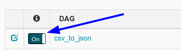
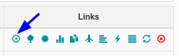
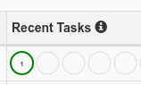
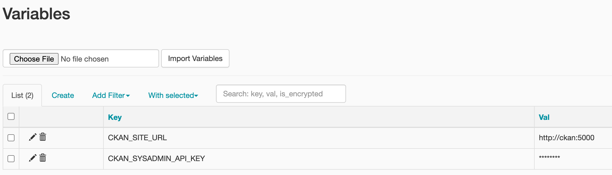
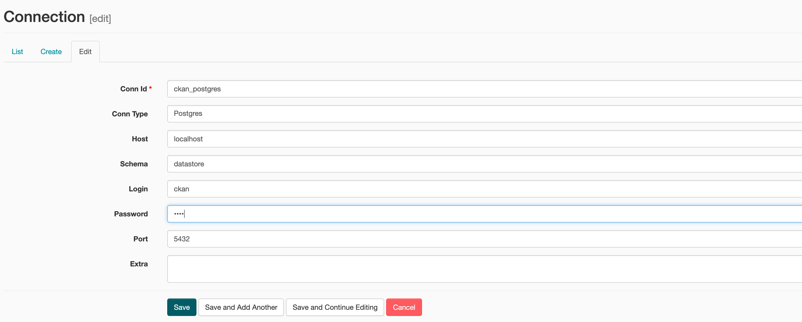
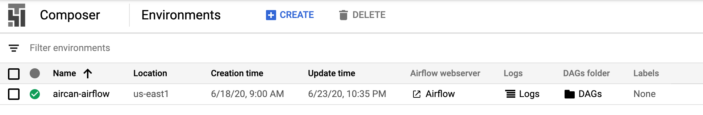
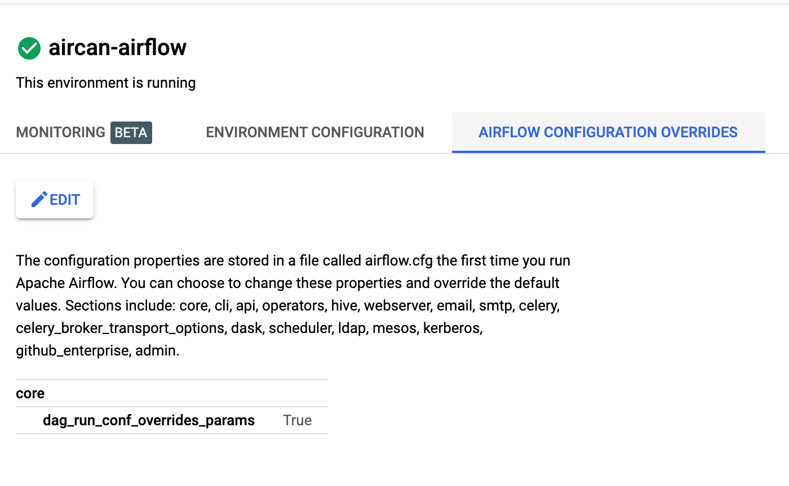
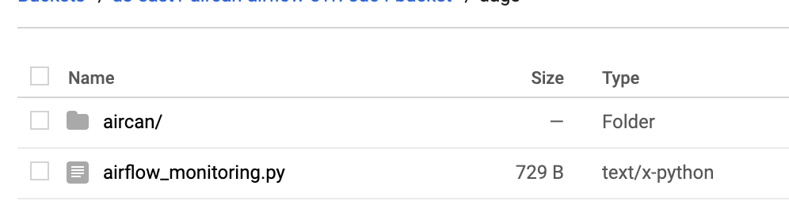
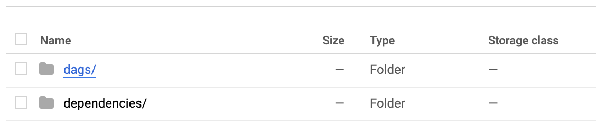

# AirCan

Load data into [CKAN DataStore](https://docs.ckan.org/en/2.8/maintaining/datastore.html) using Airflow as the runner. This is a replacement for DataPusher and Xloader.

Clean separation of components so you can reuse what you want (e.g., you don't use Airflow but your own runner).

<!-- toc -->

- [AirCan](#-aircan)
  - [Get Started](#get-started)
  - [Examples](#examples)
    - [Example 1: CSV to JSON](#example-1-csv-to-json)
  - [Using Aircan DAGs](#using-aircan-dags)
    - [Example 2: Local file to CKAN DataStore using the Datastore API](#example-2-local-file-to-ckan-datastore-using-the-datastore-api)
      - [Preliminaries: Setup your CKAN instance](#preliminaries-setup-your-ckan-instance)
    - [Ignore Example 3: Local file to CKAN DataStore using Postgres](#example-3-local-file-to-ckan-datastore-using-postgres)
      - [Preliminaries: Setup your CKAN instance](#preliminaries-setup-your-ckan-instance-1)
      - [Doing the load](#doing-the-load)
    - [Example 2a: Remote file to DataStore](#example-2a-remote-file-to-datastore)
    - [Example 3: Auto Load file uploaded to CKAN into CKAN DataStore](#examples-3-auto-load-file-uploaded-to-ckan-into-ckan-datastore)
      - [Run it](#run-it)
  - [Tutorials](#tutorials)
    - [Using Google Cloud Composer](#using-google-cloud-composer)

<!-- tocstop -->

## Get Started

* Install **Python** >= 3.5 <= 3.7.x (and make a virtual environment).
* Clone `aircan` so you have examples available:

  ```bash
  git clone https://github.com/datopian/aircan
  ```

* Install and setup **Airflow** (https://airflow.apache.org/docs/stable/installation.html):

  ```bash
  export AIRFLOW_HOME=~/airflow
  pip install apache-airflow
  airflow initdb
  ```
  
_Note_: On recent versions of Python (3.7+), you may face the following error when executing `airflow initdb`:

```bash
ModuleNotFoundError: No module named 'typing_extensions'
```

This can be solved with `pip install typing_extensions`.

* Then, start the server and visit your Airflow admin UI:

  ```bash
  airflow webserver -p 8080
  ```

By default, the server will be accessible at `http://localhost:8080/` as shown in the output of the terminal where you ran the previous command.


## Examples

### Example 1: CSV to JSON

In this example we'll run an AirCan example to convert a CSV to JSON.

Add the DAG to the default directory for Airflow to recognize it:

```bash
mkdir ~/airflow/dags/
cp examples/aircan-example-1.csv ~/airflow/
cp examples/csv_to_json.py ~/airflow/dags/
```

To see this DAG appear in the Airflow admin UI, you may need to restart the server or launch the scheduler to update the list of DAGs (this may take about a minute or two to update, then refresh the page on the Airflow admin UI):

```bash
airflow scheduler
```

Run this DAG:

* Enable the dag in the [admin UI](http://localhost:8080/) with this toggle to make it run with the scheduler:
  
  
* "Trigger" the DAG with this button:

  

* After a moment, check the output. You should see a successful run for this DAG:

  

* Locate the output on disk at `~/airflow/aircan-example-1.json`


## Using Aircan DAGs in a local Airflow instance

### Example 2: Local file to CKAN DataStore using the Datastore API

We'll assume you have:

* a local CKAN setup and running at http://localhost:5000;
* a dataset (for example, `my-dataset`) with a resource (for example, `my-resource` with the `my-res-id-123` as its `resource_id`);
* We also need to set up two environment variables for Airflow. Access the [Airflow Variable panel](http://localhost:8080/admin/variable/) and set up `CKAN_SITE_URL` and your `CKAN_SYSADMIN_API_KEY`:



#### Single-node DAG

`api_ckan_load_single_node` is a single-node DAG which deletes,creates and loads a resource to a local or remote CKAN instance. You can run the `api_ckan_load_single_node` by following these steps:

1. Open your `airflow.cfg` file (usually located at `~/airflow/airflow.cfg`) and point your DAG folder to AirCan:

```bash
dags_folder = /your/path/to/aircan

...other configs

dag_run_conf_overrides_params = True
```

Note: do not point `dags_folder` to `/your/path/to/aircan/aircan/dags`. It must be pointing to the outer `aircan` folder.

2. Verify that Airflow finds the DAGs of Aircan by running `airflow list_dags`. The output should list:

```bash
-------------------------------------------------------------------
DAGS
-------------------------------------------------------------------
ckan_api_load_single_step
...other DAGs...
```

3. Make sure you have these environment variables properly set up:

```bash
export LC_ALL=en_US.UTF-8
export LANG=en_US.UTF-8
export OBJC_DISABLE_INITIALIZE_FORK_SAFETY=YES
```

4. Run the Airflow webserver (in case you have skipped the previous example): `airflow webserver`

5. Run the Airflow scheduler: `airflow scheduler`. Make sure the environment variables from (3) are set up.

6. Access the Airflow UI (`http://localhost:8080/`). You should see the DAG `ckan_api_load_single_step` listed.

7. Activate the DAG by hitting on the **Off** button on the interface.

8. Now we can test the DAG. On your terminal, run:

```bash
airflow test \
-tp "{ \"resource_id\": \"my-res-id-123\", \
\"schema_fields_array\": \"[ 'field1', 'field2']\", \
\"csv_input\": \"/path/to/my.csv\", \
\"json_output\": \"/path/to/my.json\" }" \
ckan_api_load_single_step full_load_via_api now
```

Make sure to replace the parameters accordingly.

* `resource_id` is the id of your resource on CKAN.
* `schema_fields_array` is the header of your CSV file. Everything is being treated as plain text at this time.
* `csv_input` is the path to the CSV file you want to upload.
* The DAG will convert your CSV file to a JSON file and then upload it. `json_output` specifies the path where you want to dump your JSON file.

9. Check your CKAN instance and verify that the data has been loaded.

10. Trigger the DAG with the following:

```bash
airflow trigger_dag ckan_api_load_single_step \
 --conf='{ "resource_id": "my-res-id-123", "schema_fields_array": [ "field1", "field2" ], "csv_input": "/path/to.csv", "json_output": "/path/to.json" }'
```

Do not forget to properly replace the parameters with your data and properly escape the special characters.
Alternatively, you can just run the DAG with the `airflow run` command.


`api_ckan_load_single_node` also works for remote CKAN instances. Just set up your Airflow `CKAN_SITE_URL` variable accordingly.


#### Multiple-node DAG

`ckan_api_load_multiple_steps` does the same steps of `api_ckan_load_single_node`, but it uses multiple nodes (tasks). You can repeat the steps of the previous section and run `ckan_api_load_multiple_steps`.


### [Ignore] Example 3: Local file to CKAN DataStore using Postgres

We'll load a local csv into CKAN DataStore instance.

#### Preliminaries: Setup your CKAN instance

We'll assume you have:

* a local CKAN setup and running at http://localhost:5000
* datastore enabled. If you are using Docker, you might need to expose your Postgres Instance port. For example, add the following in your `docker-composer.yml` file:

```yml
db:
  ports:
      - "5432:5432"
```

(Useful to know: it is possible to access the Postgres on your Docker container. Run `docker ps` and you should see a container named `docker-ckan_db`, which corresponds to the CKAN database. Run `docker exec -it CONTAINER_ID bash` and then `psql -U ckan` to access the corresponding Postgres instance).

* Now you need to set up some information on Airflow. Access your local Airflow Connections panel at http://localhost:8080/admin/connection/. Create a new connection named `ckan_postgres` with your datastore information. For example, assuming your `CKAN_DATASTORE_WRITE_URL=postgresql://ckan:ckan@db/datastore`, use the following schema:



* We also need to set up two environment variables for Airflow. Access the Airflow Variable panel and set up `CKAN_SITE_URL` and your `CKAN_SYSADMIN_API_KEY`:


[TODO PARAMETERIZE VARS]
[TODO PARAMETERIZE PATHS]

Then, create a dataset called `aircan-example` using this script:

```bash
cd aircan
pip install -r requirements-example.txt
python examples/setup-ckan.py --api-key
```

#### Doing the load

We assume you now have a dataset named `my-first-dataset`.

Create the DAG for loading

```bash
cp aircan/lib/api_ckan_load.py ~/airflow/dags/
```

Check if Airflow recognize your DAG with `airflow list_dags`. You should see a DAG named `ckan_load`.

Now you can test each task individually:

* To delete a datastore, run `airflow test ckan_load delete_datastore_table now`
* To create a datastore, run `airflow test ckan_load create_datastore_table now`. You can see the corresponding `resource_id` for the datastore on your logs. [TODO JSON is hardcoded now; parameterize on kwargs or some other operator structure]
* To load a CSV to Postgres, run `airflow test ckan_load load_csv_to_postgres_via_copy now`. [TODO JSON is hardcoded now; insert resource_id on it. File path is also Hardcode, change it]
* Finally, set your datastore to active: `airflow test ckan_load restore_indexes_and_set_datastore_active now`.

To run the entire DAG:

* Select the DAG [screenshot]
* Configure it with a path to ../your/aircan/examples/example1.csv
* Run it ... [screenshot]

Check the output

* Visit http://localhost:5000/dataset/aircan-example/ and see the resource named XXX. It will have data in its datastore now!

### Example 2a: Remote file to DataStore

Same as example 2 but use this DAG instead:

```bash
cp aircan/examples/ckan-datastore-from-remote.py ~/airflow/dags/
```

Plus set a remote URL for loading.

### Examples 3: Auto Load file uploaded to CKAN into CKAN DataStore

Configure CKAN to automatically load.

* Setup CKAN - see the previous sections.
* Also install this extension in your ckan instance: `ckanext-aircan-connector`. **TODO**: add instructions.
* Configure ckan with location of your airflow instance and the DAG id (`aircan-load-csv`).

#### Run it

Run this script which uploads a CSV file to your ckan instance and will trigger a load to the datastore.

```bash
cd aircan
pip install -r requirements-example.txt
python examples/ckan-upload-csv.py
```

## 

### Using Google Cloud Composer

1. Sign up for an account at https://cloud.google.com/composer. Create or select an existing project at Google Cloud Platform. For this example, we use one called `aircan-test-project`.
2. Create an environment at Google Cloud Composer, either by command line or by UI. Make sure you select **Python 3** when creating the project. Here, we create an environment named `aircan-airflow`.


After creating your environment, it should appear in your environment list:



3. Override the configuration for `dag_run_conf_overrides_params`:



4. Access the designated DAGs folder (which will be a bucket). Upload the contents of `local/path/to/aircan/aircan` to the bucket:


The contents of the subfolder `aircan` must be:


5. Enter the subdirectory `dags` and delete the `__init__.py` file on this folder. It conflicts with Google Cloud Composer configurations.

6. Similarly to what we did on Example 2, access your Airflow instance (created by Google Cloud Composer) and add `CKAN_SITE_URL` and `CKAN_SYSADMIN_API_KEY` as Variables. Now the DAGs must appear on the UI interface.

7. Let's assume you have a resource on `https://demo.ckan.org/` with `my-res-id-123` as its resource_id. We also assume you have, in the root of your DAG bucket on Google Cloud platform, two files: One CSV file with the resource you want to upload, named `r3.csv`, with two columns, `field1` and `field2`. The other file you must have in the root of your your bucket is `r4.json`, an empty JSON file.


Since our DAGs expect parameters, you'll have to trigger them via CLI:
For example, to trigger `api_ckan_load_single_node`, run (from your terminal):
```bash
gcloud composer environments run aircan-airflow \
     --location us-east1 \
     trigger_dag -- ckan_api_load_single_step \
      --conf='{ "resource_id": "my-res-id-123", "schema_fields_array": [ "field1", "field2" ], "csv_input": "/home/airflow/gcs/dags/r3.csv", "json_output": "/home/airflow/gcs/dags/r4.json" }'
```

Check the logs (tip: filter them by your DAG ID, for example, `ckan_api_load_single_step`). It should updload the data of your `.csv` file to `demo.ckan` successfully.
